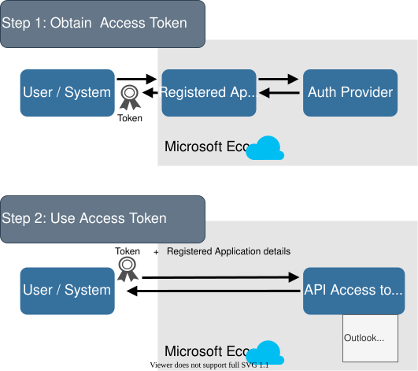

:::{.callout-note}
Disclaimer: This page discusses Microsoft-developed open source packages. For R, the `Microsoft365R` package was at version 2.3.4 at the time of initial writing. For Python, the `Office365-REST-Python-Client` library is the Microsoft-recommended approach. Readers should refer to the [Microsoft365R package documentation](https://github.com/Azure/Microsoft365R) and [Office365-REST-Python-Client documentation](https://github.com/vgrem/Office365-REST-Python-Client) for the most up-to-date information.
:::

## Introduction

[Microsoft 365](https://www.microsoft.com/en-us/microsoft-365) is a subscription extension of the Microsoft Office product line with cloud hosting support.

- For R users, the Microsoft-supported method is the [`Microsoft365R`](https://github.com/Azure/Microsoft365R) package developed by [Hong Ooi](https://github.com/hongooi73). It supports access to Teams, SharePoint Online, Outlook, and OneDrive.
- For Python users, the recommended approach is the [`Office365-REST-Python-Client`](https://github.com/vgrem/Office365-REST-Python-Client) library, which provides access to Microsoft 365 services including SharePoint Online.

This article describes approaches for authentication to Microsoft 365 for use with the [Posit professional products](https://posit.co/products/enterprise/team/). Examples for both R and Python are included, along with guidance on using managed credentials in Posit Workbench and Posit Connect for secure, enterprise-friendly access patterns. 

## Summary 

- Authentication for `Microsoft365R` is through Microsoft's Azure cloud platform through [registered applications](https://docs.microsoft.com/en-us/azure/active-directory/develop/quickstart-register-app). This grants developers access to the underlying Microsoft API for programmatic access to Microsoft resources. 
- The registered application will be used to authenticate in to the Microsoft Azure cloud platform using any of the four main authentication approaches that are supported by `Microsoft365R`. You will select the approach that fits the types of content being built and your organizations security requirements and add the needed permissions, redirect URLs, etc in order to enable access. 
- The steps for registering a custom app are provided in [this Microsoft page](https://docs.microsoft.com/en-us/azure/active-directory/develop/quickstart-register-app). 
- Graph permissions will need to be granted as specified in [the app registrations page](https://github.com/Azure/Microsoft365R/blob/master/inst/app_registration.md). Depending on your organization's security policy, access will likely need to be granted by your Microsoft Azure Global Administrator. Depending on the authentication method selected, these could be user/delegated level permissions, or Graph application level permissions. 
- Consult our page on [securing credentials](../db/best-practices/managing-credentials/) to review best practices for guarding the authentication details. 

## Authentication Options

:::{.callout-note}
Discussion between the developers and the Global Azure Administration team about your organization's content and security requirements is important to decide which approach will work best for your needs.
:::

There are several authentication approaches available. For Posit users, **managed credentials** through Posit Workbench or Posit Connect are the recommended primary option for enterprise deployments.

| **Method**                            | **auth_type** (R / Python)        | **Permissions** | **Microsoft Setup Needed** | **Capability**                  |
|---------------------------------------|----------------------|----------------|----------------|---------------------------------|
| **Managed Credentials: Workbench (Delegated)** | `rstudioapi::getDelegatedAzureToken()` / `client.oauth.get_delegated_azure_token()` | Delegated (User) | Azure app registration (admin configures), user signs in once via SSO | Interactive Workbench sessions and jobs launched from them |
| **Managed Credentials: Connect (Viewer OAuth)** | `connectapi::get_oauth_credentials()` / `client.oauth.get_credentials()` | Delegated (Viewer) | Azure app regiscctration (admin configures an OAuth integration) | Published Connect content; each viewer's own SharePoint permissions apply |
| **Managed Credentials: Connect (Service Account OAuth)** | Same as above, configured for a shared service identity | Delegated (Service Account) | Azure app registration + service account configured in the integration | Scheduled reports and content where a shared, non-viewer-specific identity is appropriate |
| **User Sign-in Flow: Default**       | default / `with_interactive()` | Delegated (User) |  Redirect URLs, user permissions | Interactive only (local IDE, Workbench, interactive Shiny/Streamlit)                |
| **User Sign-in Flow: Device Code**    | device_code / `with_device_flow()` | Delegated (User) | Enable `mobile and desktop flows`, user permissions | Interactive only (local IDE, Workbench)                |
| **Service Principal / Client Secret** | client_credentials / `with_client_secret()` | Application | Application permissions, client secret | Scheduled/non-interactive, APIs, background jobs |
| **Service Account / Embedded Credentials** | resource_owner / `with_username_and_password()` | Delegated (Service Account) | Service account credentials in code | Scheduled/non-interactive content |

## Authentication Background

Authentication for `Microsoft365R` is through Microsoft's Azure cloud platform through a [registered application](https://docs.microsoft.com/en-us/azure/active-directory/develop/quickstart-register-app). This grants developers access to the underlying Microsoft API for programmatic access to Microsoft resources. 

Within this page "application," also referred to as "app," refers to a specific part of the [Microsoft Authentication Flow](https://docs.microsoft.com/en-us/azure/active-directory/develop/authentication-flows-app-scenarios). The application is used to:

1. Obtain an ['OAuth 2.0' token](https://docs.microsoft.com/en-us/azure/active-directory/develop/active-directory-v2-protocols) by authenticating the requesting user or system  
2. Provide token to access protected APIs for interacting with Microsoft resources

{fig-alt="Diagram showing two-step process for authorization. Step 1, user obtains a token from the Registered Application. Step 2, user uses the token in interactions with the API."}

`Microsoft365R` will use a pre-existing app, ["d44a05d5-c6a5-4bbb-82d2-443123722380"](https://github.com/Azure/Microsoft365R/blob/master/inst/app_registration.md), by default that is pre-configured for use with the RStudio IDE and interactive use. Depending on your organizations security it may be blocked and need the Azure Global Administrator to grant access. This default application does not support scheduled reports or development / deployment outside of the RStudio IDE without additional configuration. 

A custom app will need to be registered if the default app is blocked or the content being developed is being run outside of the RStudio IDE and/or in a non-interactive context. Depending on the organization's security policy the custom app registration can be done either by the developer or the Azure Global Administrator. The steps for registering a custom app are provided in [this Microsoft page](https://docs.microsoft.com/en-us/azure/active-directory/develop/quickstart-register-app) with additional details below. 

Under the hood, `Microsoft365R` is using the [`AzureAuth`](https://github.com/Azure/AzureAuth) and [`AzureGraph`](https://github.com/Azure/AzureGraph) packages, also developed by [Hong Ooi](https://github.com/hongooi73), for authentication, token management, and access to the [Graph API](https://docs.microsoft.com/en-us/graph/use-the-api). In some cases, for example with troubleshooting or to remove interactive prompts in scheduled content, calling those packages directly to manage tokens is useful. 

## Authentication Configurations

### Overview and Setup Resources

Depending on your organization's security policy, app registration and credential setup may be handled by the developer, may require Azure Global Administrator support, or may need to be entirely managed by your Azure administrator.

**Key Resources for Setup:**

- **Posit Workbench Managed Credentials** (Azure):
  - [Admin Setup Guide - Delegated Azure Credentials](https://docs.posit.co/ide/server-pro/admin/authenticating_users/delegated_azure_credentials.html)
  - [User Guide - Azure Managed Credentials](https://docs.posit.co/ide/server-pro/user/posit-workbench/managed-credentials/azure.html)

- **Posit Connect OAuth Integrations** (Microsoft/Azure):
  - [Admin Setup Guide - OAuth Integrations](https://docs.posit.co/connect/admin/integrations/oauth-integrations/microsoft/)
  - [User Guide - Managing Integrations](https://docs.posit.co/connect/user/managing-integrations/)

- **Microsoft's App Registration Guide**: [Quick Start - Register an Application](https://docs.microsoft.com/en-us/azure/active-directory/develop/quickstart-register-app)

- **Microsoft365R Package Guide**: [Authentication Vignette](https://cran.r-project.org/web/packages/Microsoft365R/vignettes/auth.html) - comprehensive overview of all authentication approaches

- **App Registration & Permissions**: [Microsoft365R App Registration Reference](https://github.com/Azure/Microsoft365R/blob/master/inst/app_registration.md) - **highly recommended** detailed breakdown of required permissions, redirect URIs, platform configurations, and best practices for each authentication method

The app registration reference provides crucial details on:
- Exact Graph API permissions needed for different use cases
- Proper redirect URI configuration for different deployment scenarios
- Platform-specific setup (Desktop, Web, Mobile)
- Scope and consent configuration
- Token requirements and refresh strategies

---

### Managed Credentials (Recommended for Enterprise)

**For Posit Workbench Admins:**
Set up managed credentials to provide users with seamless Azure authentication. Azure credentials are automatically available from Workbench sessions when it has been configured with the appropriate permissions. Tokens are accessible on demand using the Software Development Kit (SDK) functions available to users.

- [Workbench Admin Setup - Delegated Azure Credentials](https://docs.posit.co/ide/server-pro/admin/authenticating_users/delegated_azure_credentials.html)

**For Posit Connect Admins:**
Configure OAuth integrations to enable viewer-based authentication for published content. Each viewer authenticates with their own identity for data access.

- [Connect Admin Setup - OAuth Integrations](https://docs.posit.co/connect/admin/integrations/oauth-integrations/microsoft/)

---

### Individual Authentication Methods

The following sections describe setup and usage for each direct authentication approach. These are typically used when managed credentials are not available. For first-time setup, reference the app registration guide linked above.

### User Sign-in Flow: Default

A custom app can be created or the default app registration "d44a05d5-c6a5-4bbb-82d2-443123722380" that comes with the `Microsoft365R` package can be used. The user permissions will need to be enabled as detailed in [the app registrations page](https://github.com/Azure/Microsoft365R/blob/master/inst/app_registration.md). Depending on your organization's security policy, access to your tenant may need to be granted by an Azure Global Administrator. Additionally, Redirect URLs will need to be added through Azure under `App Registrations` -\> `select your app` -\> `Authentication` -\> `Platform configurations` -\> `Mobile and desktop applications` -\>`Add URI` as well as also enabling `nativeclient`.

For adding Redirect URLs, which will give a typical web-app authentication experience for interactive applications: 

- For RStudio Desktop the URL is: `http://localhost:1410/`.
- For Connect and Workbench, as well as any non-local connections, the URL will be of the form `https://myserver.com/myapplication`. An SSL certificate will be required by Azure. A [wildcard](https://docs.microsoft.com/en-us/azure/active-directory/develop/reply-url#restrictions-on-wildcards-in-redirect-uris) could be used where appropriate for server-wide access. 
- For content hosted in shinyapps.io this would be of the form `https://youraccount.shinyapps.io/appname` (including the port number if specified).

### User Sign-in Flow: Device Code

A custom app can be created. User permissions will need to be enabled as detailed in [the app registrations page](https://github.com/Azure/Microsoft365R/blob/master/inst/app_registration.md). Depending on your organization's security policy, access to your tenant may need to be granted by an Azure Global Administrator.

Enabling the device code workflow is through the App Registration dashboard in Azure -\> `click on the created app` -\> `Authentication` -\> `Allow public client flows` and setting `Enable the following mobile and desktop flows` to `yes`. The device code workflow does not need Redirect URLs. Instead, this method provides a code and a link for the developer to access in a separate browser window (or even on a separate device) for sign-in. 

### Service Principal / Client Secret

A custom app will need to be registered in Azure with Application permissions. The permissions can be based off of the [user permissions](https://github.com/Azure/Microsoft365R/blob/master/inst/app_registration.md) but can be assigned as needed for the application and to comply with any security restrictions. 

Application permissions are more powerful than user permissions so it is important to emphasize that exposing the client secret directly should be avoided. As a control, using environment variables for storing the client secret is recommended. Connect allows [Environment Variables](https://docs.posit.co/connect/admin/security-and-auditing/#application-environment-variables). The variables are encrypted on-disk, and in-memory.

Adding environment variables can be done at the project level with [securing deployment](../db/best-practices/deployment/) through the [Connect UI](https://support.posit.co/hc/en-us/articles/228272368-Managing-your-content-in-RStudio-Connect). 

### Embedded Credentials

A custom app will need to be registered in Azure with User permissions as specified in [the app registrations page](https://github.com/Azure/Microsoft365R/blob/master/inst/app_registration.md). Depending on your organization's security policy, access to your tenant may need to be granted by an Azure Global Administrator. 

The credentials being embedded can be a user or a service account, as long as access to the desired content inside Microsoft 365 has been granted. Creating service accounts per content is recommended to enable faster troubleshooting and easier collaboration. As a control, the Username / Password should never be exposed directly in the code, instead using [Environment Variables](https://docs.posit.co/connect/admin/security-and-auditing/#application-environment-variables). The variables are encrypted on-disk, and in-memory. 

Adding environment variables can be done at the project level with [securing deployment](../db/best-practices/deployment/) through the [Connect UI](https://support.posit.co/hc/en-us/articles/228272368-Managing-your-content-in-RStudio-Connect). 

## Authentication Examples

### Managed Credentials (Workbench & Connect Users)

When your administrator has configured managed credentials, you can access Azure services seamlessly without managing tokens or secrets yourself. Credentials are automatically available in your environment and refreshed as needed.

**Workbench Users:**
Access managed credentials by selecting them when launching a session. See [User Guide - Azure Managed Credentials](https://docs.posit.co/ide/server-pro/user/posit-workbench/managed-credentials/azure.html) for detailed instructions.

**Connect Users (SharePoint Examples):**
Your application automatically has access to OAuth-authenticated resources. See [User Guide - Managing Integrations](https://docs.posit.co/connect/user/managing-integrations/) for details.

For practical examples of accessing SharePoint with managed credentials:
- [SharePoint Integration Cookbook (Python)](https://docs.posit.co/connect/cookbook/content/integrations/sharepoint/viewer/python/index.html)
- [SharePoint Integration Cookbook (R)](https://docs.posit.co/connect/cookbook/content/integrations/sharepoint/viewer/r/)

Accessing the token would be done with: 

::: {.panel-tabset}

## R

<!-- verified on 2026-09-17 by Lisa -->

```r
library(rstudioapi)
library(AzureAuth) 
library(Microsoft365R)
library(AzureGraph)

site_url = "https://yourorg.sharepoint.com/sites/YourSite"

# check if running on Posit Connect or Workbench
if (Sys.getenv("POSIT_PRODUCT") == "CONNECT") {
    # initialize Connect API client
    client <- connect()
    # read the user-session-token header
    user_session_token <- session$request$HTTP_POSIT_CONNECT_USER_SESSION_TOKEN
    # grab the OAuth Integration access token using the session token
    credentials <- get_oauth_credentials(client, user_session_token)
    token <- credentials$access_token
  } else if (Sys.getenv("POSIT_PRODUCT") == "WORKBENCH") {
    # resource must be Microsoft Graph, since Microsoft365R talks to Graph, not the SharePoint REST API
    credentials <- rstudioapi::getDelegatedAzureToken("https://graph.microsoft.com")
    token <- credentials$access_token
  } else {
    # grab the access token from the SHAREPOINT_TOKEN env var if running locally
    token <- Sys.getenv("SHAREPOINT_TOKEN")
  }

# Create auth token cache directory
create_AzureR_dir()

# wrap the raw access token in a proper AzureAuth token object
sharepoint_token <- get_manual_token(token)

# use the exported token directly, skipping any interactive app/tenant login
site <- get_sharepoint_site(site_url = site_url, token = sharepoint_token)
cat("Connected to:", site$properties$webUrl, "\n")
```

[View `getDelegatedAzureToken()` documentation](https://rstudio.github.io/rstudioapi/reference/getDelegatedAzureToken.html).

## Python

<!-- verified on 2026-09-17 by Lisa -->

```python
import os
import requests
# pip install posit-sdk 
from posit import connect
from posit.workbench import Client
# pip install Office365-REST-Python-Client 
from office365.sharepoint.client_context import ClientContext

SITE_URL = "https://yourorg.sharepoint.com/sites/YourSite"
SITE_URL_ROOT = "https://yourorg.sharepoint.com # tenant root, not /sites/YourSite

# check if running on Posit Connect or Workbench
if os.getenv("POSIT_PRODUCT") == "CONNECT":
    client = connect.Client()

    # grab the user session token from headers
    # for streamlit
    user_session_token = st.context.headers.get("Posit-Connect-User-Session-Token")
    # for flask
    # user_session_token = get_request_header("Posit-Connect-User-Session-Token")

    try:
        # fetch the access token using the session token
        access_token = client.oauth.get_credentials(user_session_token).get(
            "access_token"
        )
    # if the refresh token has expired prompt the user to login again
    except connect.errors.ClientError as e:
        if e.error_code == 219:
            print(
                "Your SharePoint refresh token has expired. Please log out and then log back into the integration."
            )
elif os.getenv("POSIT_PRODUCT") == "WORKBENCH":
    client = Client()
    # Resource must match the SharePoint tenant, not Graph, for office365-rest-python-client
    full_token = client.oauth.get_delegated_azure_token(SITE_URL_ROOT)
    # For other resources you would use graph or a different url 
    # full_token = client.oauth.get_delegated_azure_token("https://graph.microsoft.com")
    access_token = full_token["access_token"]
else:
    # grab access token from env var if running locally
    access_token = os.getenv("SHAREPOINT_TOKEN")

# use the acquired access token to authenticate against SharePoint directly,
# skipping any interactive/browser login since we already have a token
def acquire_token():
    return {"access_token": access_token, "token_type": "Bearer"}

ctx = ClientContext(SITE_URL).with_access_token(acquire_token)
web = ctx.web.get().execute_query()
print(f"Connected to: {web.url}")
```

[View `get_delegated_azure_token()` documentation](https://posit-dev.github.io/posit-sdk-py/reference/workbench.oauth.OAuth.html#posit.workbench.oauth.OAuth.get_delegated_azure_token).

:::

### User Sign-in Flow: Default

The user sign-in flow option provides the typical web browser authentication experience. A user will need to be available to interact with the authentication pop-up, making this suitable for interactive applications (such as the local RStudio IDE, Workbench, or an interactive Shiny/Streamlit app), but not for scheduled content.

:::{.callout-warning}
Pass `tenant` explicitly for any custom (non-default) app registration. If omitted, Microsoft365R falls back to the generic `/common/` endpoint, which fails with `AADSTS50194` for single-tenant apps — the default configuration for a custom app registration, and the setup most readers of this article will actually have.
:::

::: {.panel-tabset}

## R

```r
library(Microsoft365R)

site_url = "https://yourorg.sharepoint.com/sites/YourSite"
app = "your-app-id"
tenant = "your-tenant-id"

site <- get_sharepoint_site(site_url = site_url, app = app, tenant = tenant)
cat("Connected to:", site$properties$webUrl, "\n")
```

See [the auth vignette](https://cran.r-project.org/web/packages/Microsoft365R/vignettes/auth.html) for more details.

## Python

```python
from office365.sharepoint.client_context import ClientContext

site_url = "https://yourorg.sharepoint.com/sites/YourSite"
tenant = "your-tenant-id"
client_id = "your-app-id"

ctx = ClientContext(site_url).with_interactive(tenant, client_id)
web = ctx.web.get().execute_query()
print(f"Connected to: {web.url}")
```

:::

### User Sign-in Flow: Device Code

In some interactive cases it may be easier to use the device code flow where the user is prompted with a code and a link which is opened in a separate screen for logging in. For example, for using a Workbench instance deployed without an SSL certificate. This requires interaction from the user and is not applicable for scheduled content. See [the auth vignette](https://cran.r-project.org/web/packages/Microsoft365R/vignettes/auth.html) for more details.

::: {.panel-tabset}

## R

```r
library(Microsoft365R)

site_url = "https://yourorg.sharepoint.com/sites/YourSite"
app = "your-app-id"
tenant = "your-tenant-id"

site <- get_sharepoint_site(site_url = site_url, app = app, tenant = tenant, auth_type = "device_code")
cat("Connected to:", site$properties$webUrl, "\n")
```

## Python

```python
from office365.sharepoint.client_context import ClientContext

site_url = "https://yourorg.sharepoint.com/sites/YourSite"
tenant = "your-tenant-id"
client_id = "your-app-id"

# Prints the verification URL and code to the console automatically
ctx = ClientContext(site_url).with_device_flow(tenant, client_id)
web = ctx.web.get().execute_query()
print(f"Connected to: {web.url}")
```

:::

### Service Principal / Client Secret

Content in a non-interactive context (such as scheduled reports) won't have a user account available for interactive authentication. The Service Principal via Client Secret is the Microsoft-recommended approach for non-interactive scenarios. See [the vignette](https://cran.r-project.org/web/packages/Microsoft365R/vignettes/scripted.html) for more details.

**Important Security Notes:**
- Application permissions are more powerful than user permissions, so avoid exposing the client secret directly in code
- Store the client secret as an [Environment Variable](https://docs.posit.co/connect/admin/security-and-auditing/#application-environment-variables) via the [Connect UI](https://support.posit.co/hc/en-us/articles/228272368-Managing-your-content-in-RStudio-Connect)
- For R, use [AzureAuth](https://github.com/Azure/AzureAuth) to remove console prompts: `AzureAuth::create_AzureR_dir()`

::: {.panel-tabset}

## R

```r
library(AzureAuth)
library(AzureGraph)
library(Microsoft365R)

tenant = "your-tenant-id"
site_url = "https://yourorg.sharepoint.com/sites/YourSite"
app = "your-app-id"

# Add sensitive variables as environmental variables so they aren't exposed
client_secret <- Sys.getenv("EXAMPLE_SHINY_CLIENT_SECRET")

# Create auth token cache directory
create_AzureR_dir()

# Create a Microsoft Graph login
gr <- create_graph_login(tenant, app, password = client_secret, auth_type = "client_credentials")

# An example of using the Graph login to connect to a SharePoint site
site <- gr$get_sharepoint_site(site_url)
cat("Connected to:", site$properties$webUrl, "\n")
```

## Python

```python
import os
from office365.sharepoint.client_context import ClientContext

tenant_id = os.getenv("TENANT_ID")
client_id = os.getenv("CLIENT_ID")
client_secret = os.getenv("EXAMPLE_CLIENT_SECRET")
site_url = "https://yourorg.sharepoint.com/sites/YourSite"

ctx = ClientContext(site_url).with_client_secret(tenant_id, client_id, client_secret)
web = ctx.web.get().execute_query()
print(f"Connected to: {web.url}")
```

:::

### Embedded Credentials

Content in a non-interactive context (such as scheduled reports) won't have a user account available for interactive authentication. In cases where Application-level permissions aren't appropriate for your organization's security requirements, use embedded credentials instead. See [the vignette](https://cran.r-project.org/web/packages/Microsoft365R/vignettes/scripted.html) for more details.

**Important Security Notes:**

- Embedded credentials can be a user account or service account; working with your Azure administrator to create service accounts per content is recommended
- Store credentials as [Environment Variables](https://docs.posit.co/connect/admin/security-and-auditing/#application-environment-variables) via the [Connect UI](https://support.posit.co/hc/en-us/articles/228272368-Managing-your-content-in-RStudio-Connect)
- For R, use [AzureAuth](https://github.com/Azure/AzureAuth) to remove console prompts
- See our [best practices guide](../db/best-practices/deployment/#credentials-inside-environment-variables-in-rstudio-connect) for environment variable patterns

::: {.panel-tabset}

## R

```r
library(AzureAuth)
library(AzureGraph)
library(Microsoft365R)

tenant = "your-tenant-id"
site_url = "https://yourorg.sharepoint.com/sites/YourSite"
app = "your-app-id"

# Add sensitive variables as environmental variables so they aren't exposed
user <- Sys.getenv("EXAMPLE_MS365R_SERVICE_USER")
pwd <- Sys.getenv("EXAMPLE_MS365R_SERVICE_PASSWORD")
app_secret <- Sys.getenv("EXAMPLE_MS365R_APP_SECRET")

# Create auth token cache directory, otherwise it will prompt the user on the console for input
create_AzureR_dir()

# Create a Microsoft Graph login
gr <- create_graph_login(tenant, app,
                    username = user,
                    password = pwd,
                    token_args = list(client_secret = app_secret),
                    auth_type = "resource_owner")

# An example of using the Graph login to connect to a SharePoint site
site <- gr$get_sharepoint_site(site_url)
cat("Connected to:", site$properties$webUrl, "\n")
```

## Python

```python
import os
from office365.sharepoint.client_context import ClientContext

tenant_id = os.getenv("TENANT_ID")
client_id = os.getenv("CLIENT_ID")
site_url = "https://yourorg.sharepoint.com/sites/YourSite"

# Service account credentials
service_user = os.getenv("EXAMPLE_MS365_SERVICE_USER")
service_password = os.getenv("EXAMPLE_MS365_SERVICE_PASSWORD")

ctx = ClientContext(site_url).with_username_and_password(
    tenant_id, client_id, service_user, service_password
)
web = ctx.web.get().execute_query()
print(f"Connected as service account to: {web.url}")
```

:::

### Troubleshooting Authentication Failures

::: {.panel-tabset}

## R

In the case of authentication failures, clear cached authentication tokens/files:

```r
library(AzureAuth)
library(AzureGraph)

tenant = "your-tenant-id"

AzureAuth::clean_token_directory()
AzureGraph::delete_graph_login(tenant = "your-tenant-id")
```

## Python

`Office365-REST-Python-Client` uses MSAL internally for the `with_interactive`/`with_device_flow`/`with_username_and_password`/`with_client_secret` methods shown above. None of these examples configure a persistent MSAL token cache, so each new `ClientContext` re-authenticates from scratch (there's typically nothing on disk to clear unless your own code explicitly set one up).

:::

## More SharePoint Examples

### Managed Credentials — Recommended

For the best experience in production, use Posit Connect OAuth integrations (viewer-based). Each viewer uses their own SharePoint permissions:

- [Connect and SharePoint Integration Cookbook (Python)](https://docs.posit.co/connect/cookbook/content/integrations/sharepoint/viewer/python/index.html)
- [Connect and SharePoint Integration Cookbook (R)](https://docs.posit.co/connect/cookbook/content/integrations/sharepoint/viewer/r/)
- [Workbench and Sharepoint Example Workflows R and Python](https://docs.posit.co/ide/server-pro/user/posit-workbench/managed-credentials/azure.html#example-workflows) 

### Direct Authentication Via Client Secret Static Examples

The authentication method used in these examples can be any of the methods shown above. The documentation on `Microsoft365R` (for R) and `Office365-REST-Python-Client` (for Python) contains extensive examples.

::: {.panel-tabset}

## R

```r
library(Microsoft365R)
library(AzureGraph)
library(AzureAuth)

site_url = "https://yourorg.sharepoint.com/sites/YourSite"
tenant = "your-tenant-id"
app = "your-app-id"
drive_name = "Documents"
file_src = "myfile.csv"

# Add sensitive variables as environment variables so they aren't exposed
client_secret <- Sys.getenv("EXAMPLE_SHINY_CLIENT_SECRET")

# Create auth token cache directory
create_AzureR_dir()

# Create a Microsoft Graph login
gr <- create_graph_login(tenant, app, password = client_secret, auth_type = "client_credentials")

# Connect to a SharePoint site
site <- gr$get_sharepoint_site(site_url)

# Get a specific drive (document library)
drv <- site$get_drive(drive_name)

# Download a specific file
drv$download_file(src = file_src, dest = "tmp.csv", overwrite = TRUE)

# List items in the drive
drv$list_items()
drv$list_files()
drv$list_shared_files()
drv$list_shared_items()

# Upload file to SharePoint
drv$upload_file(src = "local_file.csv", dest = "remote_file.csv")
```

## Python

```python
import os
from office365.sharepoint.client_context import ClientContext

site_url = "https://yourorg.sharepoint.com/sites/YourSite"
tenant_id = os.getenv("TENANT_ID")
client_id = os.getenv("CLIENT_ID")
client_secret = os.getenv("EXAMPLE_CLIENT_SECRET")
list_title = "Documents"  # the document library's name
file_path = "Shared Documents/myfile.csv"  # server-relative path

ctx = ClientContext(site_url).with_client_secret(tenant_id, client_id, client_secret)

# Get the document library's root folder
folder = ctx.web.lists.get_by_title(list_title).root_folder

# List files in the folder
files = folder.files.get().execute_query()
for file in files:
    print(file.name)

# Download a file
with open("tmp.csv", "wb") as local_file:
    ctx.web.get_file_by_server_relative_path(file_path).download(local_file).execute_query()

# Upload a file to the same folder
with open("local_file.csv", "rb") as f:
    folder.files.upload(f).execute_query()

# Delete a file
ctx.web.get_file_by_server_relative_path("Shared Documents/local_file.csv").delete_object().execute_query()
```

:::

### Direct Authentication Via Embedded Service Account Credentials (Resource Owner Flow) Static Examples

For legacy Shiny applications or non-Connect deployments using embedded credentials:

```R
# Example using Resource Owner Flow as described in the 'Service Account' section in https://cran.r-project.org/web/packages/Microsoft365R/vignettes/scripted.html 
# Authentication and requirements from Azure side (app set up) described in https://cran.r-project.org/web/packages/AzureGraph/vignettes/auth.html 
# Access to Sharepoint and how to use the various functions described under `Creating a custom app registration` in https://cran.r-project.org/web/packages/Microsoft365R/vignettes/od_sp.html and the API permissions listed under https://github.com/Azure/Microsoft365R/blob/master/inst/app_registration.md


library(AzureAuth)
library(AzureGraph)
library(Microsoft365R)
library(shiny)
library(DT)
library(spsComps)

tenant = Sys.getenv("EXAMPLE_TENANT", "")
app=Sys.getenv("EXAMPLE_APP", "")
site_url = "https://yourorg.sharepoint.com/sites/YourSite" # application with user permissions
drive_name = "Documents"
file_src = "penguins_raw.csv"

# Add sensitive variables as environmental variables so they aren't exposed
user <- Sys.getenv("EXAMPLE_MS365R_SERVICE_USER")
pwd <- Sys.getenv("EXAMPLE_MS365R_SERVICE_PASSWORD")

# Create auth token cache directory, otherwise it will prompt the user on the console for input
create_AzureR_dir()

foo <- function() {
  message("Starting Microsoft Graph login and data pull")

  # create a Microsoft Graph login
  gr <- create_graph_login(tenant, app, 
                           username = user, 
                           password = pwd,
                           auth_type="resource_owner")


  # SharePoint site
  site <- gr$get_sharepoint_site(site_url)

  # Note the function get_drive() uses drive_id as a parameter (NOT drive name)
  drv <- site$get_drive(drive_name)

  # Downloading the file:
  drv$download_file(src = file_src, dest = "tmp.csv", overwrite = TRUE)

  # Reading file into memory
  data <- read.csv(file="tmp.csv", stringsAsFactors = FALSE, check.names=F)

  return(data)
}


ui = fluidPage(
  actionButton("btn1", "Log into Azure and Show Sharepoint File"),
  DT::dataTableOutput("table1")
)

server = function(input,output, session) {
  #Reactive values for the data, https://mastering-shiny.org/index.html is a great resource for learning Shiny
  rv <- reactiveValues()
  rv$data <- NULL

  #btn1
  observeEvent(input$btn1, {
    showNotification("btn1: Running")
    spsComps::shinyCatch({
      rv$data <- foo()
    },

    blocking_level = "error",
    prefix = "My-project" 
    )
  })

  # Output
  output$table1 <- DT::renderDataTable({
    rv$data
  })
}

# Run the application 
shinyApp(ui = ui, server = server)

#### The AzureR packages save your login sessions so that you don’t need to reauthenticate each time. If you’re experiencing authentication failures, you can try clearing the saved data by running the following code:
#
# AzureAuth::clean_token_directory()
# AzureGraph::delete_graph_login(tenant="mytenant")
```

### Sharepoint and Pins Example

Microsoft resources can be used for hosting data in pins format using [`pins::board_ms365()`](https://pins.rstudio.com/reference/board_ms365.html). The authentication method used in this example could be swapped out for any of the examples shown above. 

```r
library(Microsoft365R)
library(pins)

tenant = Sys.getenv("EXAMPLE_TENANT", "")
app=Sys.getenv("EXAMPLE_APP", "")
site_url = "https://yourorg.sharepoint.com/sites/YourSite" # application with user permissions

# Create a Microsoft Graph login
site <- get_sharepoint_site(site_url = site_url, app = app, tenant = tenant, auth_type = "device_code")

# An example getting the default drive 
doclib <- site$get_drive()

# Connect ms365 as a pin board. If this folder doesn't already exist it will be created on execution. 
board <- board_ms365(drive = doclib, "general/project1/board")

# Write a dataset as a pin to SharePoint
board %>% pin_write(mtcars, "mtcars", description = "This is a test")

# View the metadata of the pin we just created 
board %>% pin_meta("mtcars")

# Read the pin
test <- board %>% pin_read("mtcars")
```

## Other Azure service URL's 

To retrieve a token a user needs to specify the URI for the Azure service. Here is a table for common resources (as taken from [here](https://docs.posit.co/ide/server-pro/user/posit-workbench/managed-credentials/azure.html#getting-an-access-token)): 


|Azure Service|Resource URI|
|---|---|
|Azure Storage|`https://storage.azure.com`|
|Azure Key Vault|`https://vault.azure.net`|
|Azure SQL Database|`https://database.windows.net`|
|Azure Management|`https://management.azure.com`|
|Microsoft Graph|`https://graph.microsoft.com`|

## Other Microsoft 365 Related Resources

There are a few cases not covered in this article where the below resources may be useful: 

 - For readers interested in directly interacting with the [Graph API](https://docs.microsoft.com/en-us/graph/use-the-api), the Microsoft page on [Working with SharePoint sites in Microsoft Graph](https://docs.microsoft.com/en-us/graph/api/resources/sharepoint?view=graph-rest-1.0) is a useful starting reference. 

 - For Python users the [Microsoft REST API](https://github.com/vgrem/Office365-REST-Python-Client) is the Microsoft-developed and recommended method for accessing Microsoft 365 resources. Note that SharePoint access is using the older [SharePoint 2013 REST API](https://docs.microsoft.com/en-us/previous-versions/office/developer/sharepoint-rest-reference/jj860569(v=office.15)?redirectedfrom=MSDN). 

 - Mapping SharePoint, OneNote, or other systems as a network drive to the hosting server could be considered, using a third-party developed program such as [expandrive](https://www.expandrive.com/onedrive-for-linux/). Note that this method also relies on application registration and it is unclear to this author how authentication is handled.  


